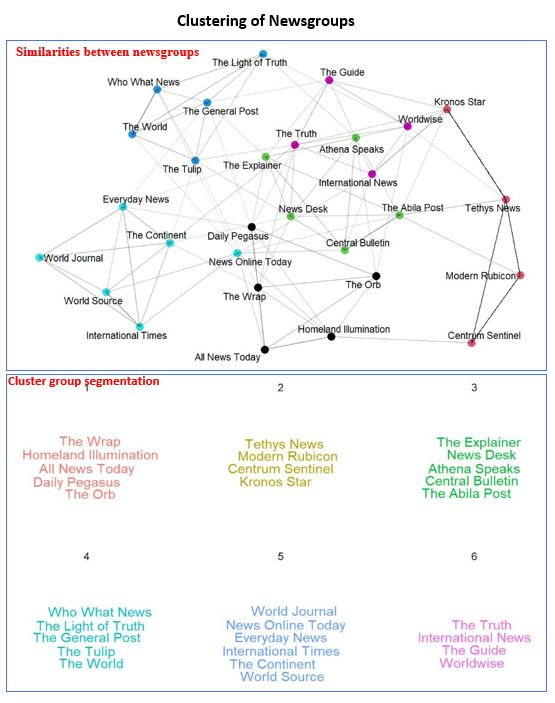
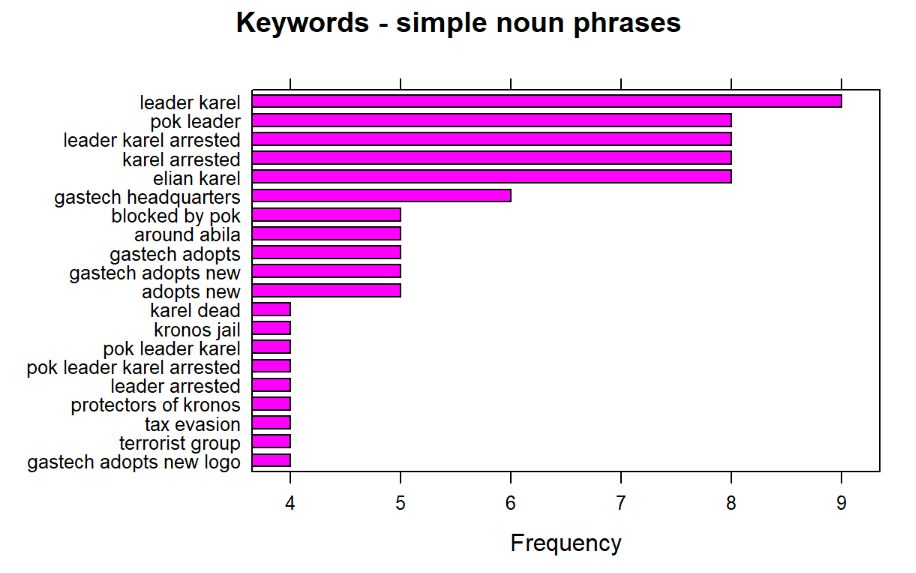

```{r setup, include=FALSE}
knitr::opts_chunk$set(echo = TRUE, warning=FALSE,message=FALSE)
```

## 4.1 Characterization of News Data Sources

### 4.1.1 Correlated Articles

The correlation graph shows that there are certain newsgroups highly correlated to each other with a value as much as 0.9. Two of the most correlated newsgroups are the "The World" and "Who What News". These are the nodes that has the thickest edge connecting them and the thicker the line, the more similar words these two newsgroups have in common. The wordclouds for the two mentioned newsgroups give a more deeper understanding of the words that are similar and it appears that both of these published articles mostly containing the words "gastech", "kronos", "government", "contamination" and "environment". From this, we can understand that these news groups voiced out about the problems created by the GasTech company. 

<center>
{width=90%}
</center>

### 4.1.2 Phrases Occuring Together

From the bigram plot below, we can understand the usage a a few words. For example, "sten" and "sanjorge" individually is difficult to understand what it means but from the bigram notation, we can understand that it is referring to the CEO of GasTech Jr Sten Sanjorge. Another interesting phrase is 'abila police force' and '20 jan 2014' which specifies the day of the incident.

One notable observation from this plot is the connection between "kronos", "government" and "pok". This connection shows that both the government and pok were equally referred to across all articles and this can be extracted from the darkness of the arrow which is same for "kronos -> government" and "kronos -> pok". Also, the term 'gas' was not only used to specify the fields and drilling of the GasTech company but also shows so traces of "tear gas" which the police could have used against the protesters.

<center>
{width=80%}
</center>
***
## 4.2 Biases identified in the News Sources
 
### 4.2.1 Setting the Scene

The newsgroups are divided into 6 clusters based on the their use of the same words. These clusters can be identified with the different color schemes and the thicker the edge between two nodes suggests that the nodes are more similar.

From the text plot, it is visible that cluster number 2 consisting of "Tethys News", "odern Rubicon", "Centrum Sentinel" and "Kronos Star" have more number of similar words as the edges connecting them are darker.

<center>
{width=70%}
</center>

### 4.2.2 Content across Clusters

The content across all articles in cluster 1 seems to be related to the leader of POK Elian Karel, the government and the police. There also are some traces of water most likely representing the water contamination that is occurring. In the whole, this cluster talks more about the relationship between the police, government and Elian Karel with very little involvement of GasTech company. 

On the other hand, cluster 2 focuses more on the POK and avoids targeting any one member of the group. This cluster also takes about the employees withing GasTech which was not seen in cluster 1.  Moving on to cluster 3, this is quite similar to cluster 1 other than the fact that ther is not mention of Elian Karel in this cluster.

<center>
{width=90%}
</center>


The articles in cluster 4 are the only ones that have talked about GAStech CEO Sten Sanjorge, Jr. There is also a strong relation between "gastech", "international" and "kronos" which could suggest that the CEO has brought up talks about investing in international lad potentially being Kronos. Cluster 5 in general is categorized into two aspect. One talks about the type of company GasTeach is and this can be understood by the relation between "oil", "energy", "tethys" and "gas". The other category talks about the relation between the government and POK.

The last and final cluster mainly focuses on the tension between the police and POK just like in cluster 2 however, there are also some minor article written about health and this is the only cluster that mentioned this.

<center>
{width=90%}
</center>

### 4.2.3 Comparing Titles

From the wordcloud below, it is visible that "News Online Today" is the newsgroup that mostly talked about the situation in Kronos.It talked mostly about POK but on the contrast, very little was spoken about the contamination and health of the villagers. Due this, it appears that the newsgroup is biased by targeting the POK group the most. On the other hand, "The Continent" seems to have reported most articles on the calamity, evacuation and discharge but no keywords resemble the GasTech nor the POK. "Everyday News" talked more on the crashes and explode that were occurring in Kronos. The remaining 3 newsgroups appear to be international groups and their keywords are vary diverse and none specifically talking about the situation in Kronos.

<center>
{width=70%}
</center>

### 4.2.4 Frequency of keywords in Titles

For the year 2009, the most frequent noun-verb pair in titles is "leader karel". The other most common keywords such as "karel arrested" suggests that in 2009 POK's leader Elian Karel has been arrested. Other events that have taken place in this year are "gastech adopting new logo".

<center>
{width=80%}
</center>

### 4.2.5 Timeline: Unfolding of Events across Years

After obtaining all of the most frequent keywords from the titles of all articles across all years, the timeline shows that from 1982 to 1994, there have been talks about foreign investment and this could suggest that the Tethys based GasTech company is looking to invest its company in another country and towards the end of that period, they have settled on Kronos which can be derived from "Shores of Kronos" keyword in 1994.

Within two years of the opening of the company, there have been discussions about possible contamination as seen from keyword in 1997. During the period of 1998 to 2004, there have been many instances where "public health" was in talks and this suggests that the issue on the health due to the contamination by GasTech company was a serious matter and was mentioned in many articles. From 2007 onward, we can see keywords representing protests which represents the POK becoming stronger year after year.

<center>
{width=90%}
</center>

***
## 4.3 Exploring Relationships

### 4.3.1 Overall Distribution of Emails

Upon dividing all emails to their respective dates, it is visible that there was more activity on the 14th and 15th of January 2014 compared to any other dates. Among all employment type groups, the activity amongst 'Information Technology' seems quite suspicious with very unevenly distributed with 14th Jan having the most number or email transmissions compared to any other day. The 'Executives' seem to have little communication with other employment groups. To extract further information,the emails were segregated into work and non-work related as shown below.


<center>
{width=100%}
</center>

**Work Related Emails**

*   After viewing the work related emails, we can see that there is heavy weight assigned to Information Technology and this eliminates any suspicious activity we assumed earlier.

*   The employees within the Engineering department seem to have more communication between themselves than with other departments.

*   There is one particular Information Technology employee who seems to have communication with the Security and Administration departments but not with the Information Technology department itself which appears to be a bit fishy.

**Non-Work Related Emails**

*   The Executive department has more number of non-work related emails than work related and this can be explained by the thickness of the edges between them.

*   One Information Technology employee appears to be the most common receiver and sender of non owrk related emails and this can be extracted by the placement of one blue node at the center.

*   There is heavy transmission of unofficial emails among the Administrative department and such activity has been further explored to identify any possible leads to the incident in the coming visualizations.

### 4.3.2 Deeper Look into Sensitive Emails

Among all the non-work related emails, after filter the emails with subjects belonging to either **Politics, Kronos or Media**, some strong insights are extracted. It is clear now that the email exchanges between the executives were mostly those with sensitive content and hence, were not shared with the other employees. Also, it is notable that there is a group of all Kronos nationals belonging to the Security department having discussions on such sensitive content and the employees are "Hennie Osvaldo", "Inga Ferro", "Isia Vann", "Loreto Bodrogi" and "Minke Mies".

<center>
{width=90%}
</center>

### 4.3.3 Citizenship Biases in Employment Type

The employees who are Kronos citizens were only offered employment in the administration, facilities and security. All the higher profile jobs such as engineering, information technology and executive were only offered to those who are Tethys citizens. 

<center>
{width=90%}
</center>

### 4.3.4 Most Important Employees

Of all emails taht were exchanged in the duration of two weeks, there are 3 employees who are identified to have been the most common entities across all subjects. Among these three, two of them are Tethys citizens whereas the remaining employee if a citizen of Kronos.

<center>
{width=70%}
</center>