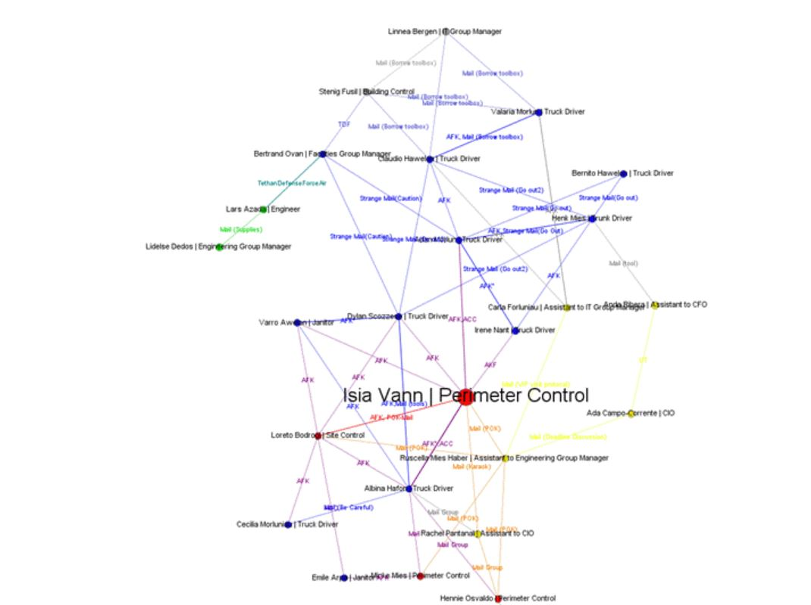

```{r setup, include=FALSE}
knitr::opts_chunk$set(echo = TRUE, warning=FALSE,message=FALSE)
```

## 1.0 Background & Literature Review

### 1.1 Backgroung

This visual investigation is based on [VAST Challenge 2021 - The Kronos Incident Mini Challenge 1](https://vast-challenge.github.io/2021/MC1.html). The overview of the challenge is as below:

"In the roughly twenty years that Tethys-based GAStech has been operating a natural gas production site in the island country of Kronos, it has produced remarkable profits and developed strong relationships with the government of Kronos. However, GAStech has not been as successful in demonstrating environmental stewardship.

In January, 2014, the leaders of GAStech are celebrating their new-found fortune as a result of the initial public offering of their very successful company. In the midst of this celebration, several employees of GAStech go missing. An organization known as the Protectors of Kronos (POK) is suspected in the disappearance, but things may not be what they seem."

**Mini-Challenge 1** looks at the relationships and conditions that led up to the kidnapping. As an analyst, you have a set of current and historical news reports at your disposal, as well as resumes of numerous GAStech employees and email headers from two weeks of internal GAStech company email. Can you identify the complex relationships among all of these people and organizations?

**Questions**

1) Characterize the news data sources provided. Which are primary sources and which are derivative sources? What are the relationships between the primary and derivative sources?

2) Characterize any biases you identify in these news sources, with respect to their representation of specific people, places, and events. Give examples.

3) Given the data sources provided, use visual analytics to identify potential official and unofficial relationships among GASTech, POK, the APA, and Government. Include both personal relationships and shared goals and objectives. Provide evidence for these relationships.

### 1.2 Literature Review of 2014 VAST Challenge

The 2021 IEEE VAST Challenge is a variation on a 2014 year’s challenge with modified data and new questions. So this literature review is based on some of the submissions from that year.

**1)    Timeline Visualizations**

{width=70%}

From the images above, the timeline in [figure 'a'](http://visualdata.wustl.edu/varepository/VAST%20Challenge%202014/challenges/MC1%20-%20Disappearance%20at%20GASTech/entries/Peking%20University/) consists of too much text and appears to be very cluttered. When any graph is built, one must work on showing what is required and what is not. Putting in the whole text for every event makes it difficult for the user to identify the important aspects and also it is not very readable. The graph also seems a little inconsistent as a few of the vertical lines are dotted and some are not. There should have been a legend to show the differences.

Coming to timeline shown in [figure 'b'](http://visualdata.wustl.edu/varepository/VAST%20Challenge%202014/challenges/MC1%20-%20Disappearance%20at%20GASTech/entries/Tianjin%20University%20-%20Cai/), even thought the plot is not cluttered, the circled numbers of events not being attached to the vertical lines makes it difficult to understand at what time instance the event falls under.

**2)    Text Visualization**

{width=70%}

In the [figure](http://visualdata.wustl.edu/varepository/VAST%20Challenge%202014/challenges/MC1%20-%20Disappearance%20at%20GASTech/entries/Peking%20University/) above ,users are provided with text across various articles to compare. This makes it very difficult for a user to interpret the main aspects across all the articles. Instead of showcasing the whole text in the articles, the user could have been provided an option to select the articles he wants to compare and the visualization of these articles can be in the form of wordcloud which makes it more easy to look at the most important terms used.

Also if there are more articles to be included to the dataset, then the number of articles shown to the user would also increase making it all the more cluttered then it already is. Therefore, giving the option to the user to select the articles he wants to view and compare with would be a more ideal solution.

**3)    How Much is Too Much**

{width=90%}

[Screen shot 'a'](http://visualdata.wustl.edu/varepository/VAST%20Challenge%202014/challenges/MC1%20-%20Disappearance%20at%20GASTech/entries/Tianjin%20University%20-%20Gao/) of a visualization dashboard shown above consists of 3 different plots that contain too much of data making it difficult to view the wordings. When showcasing multiple plots in one page, it is better to use a subset of the data to visualize because by doing so, the amount of data to visualize would decrease and this makes the plots more readable. One way in which this approach can be achieved by clustering the data and then provide the use an option to select the cluster he wants to visualize.

The same applies for the second [figure 'b'](http://visualdata.wustl.edu/varepository/VAST%20Challenge%202014/challenges/MC1%20-%20Disappearance%20at%20GASTech/entries/Peking%20University/). Here, the user is given an option to select a user from a dropdow. However, the comparisons performed with the selected user are too many and the plot appears to be very cluttered making it difficult to read the wordings. Similar to what was suggested earlier, considering clustering the data will help reduce the clutter.


**4)   Network Graph**

{width=70%}

The network [graph](http://visualdata.wustl.edu/varepository/VAST%20Challenge%202014/challenges/MC1%20-%20Disappearance%20at%20GASTech/entries/Peking%20University/) above, consists of many nodes and due to the overlap of the node names with the edges, some of the text is difficult to read. An alternat approact would e to divide the network graph into sub graphs. When the graph is divided, it makes the graphs less dense and also enhances the redability.