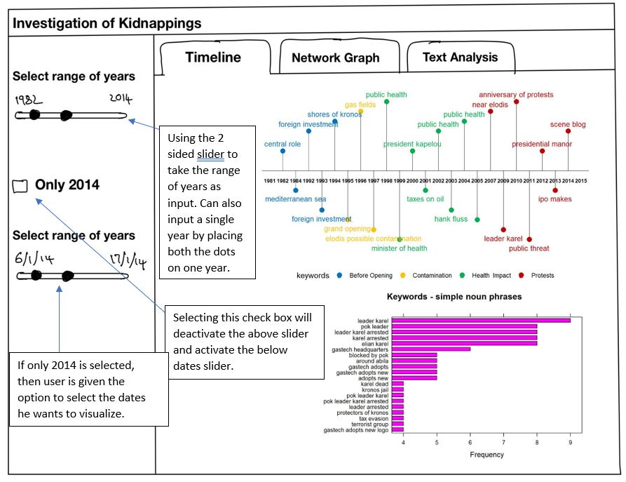
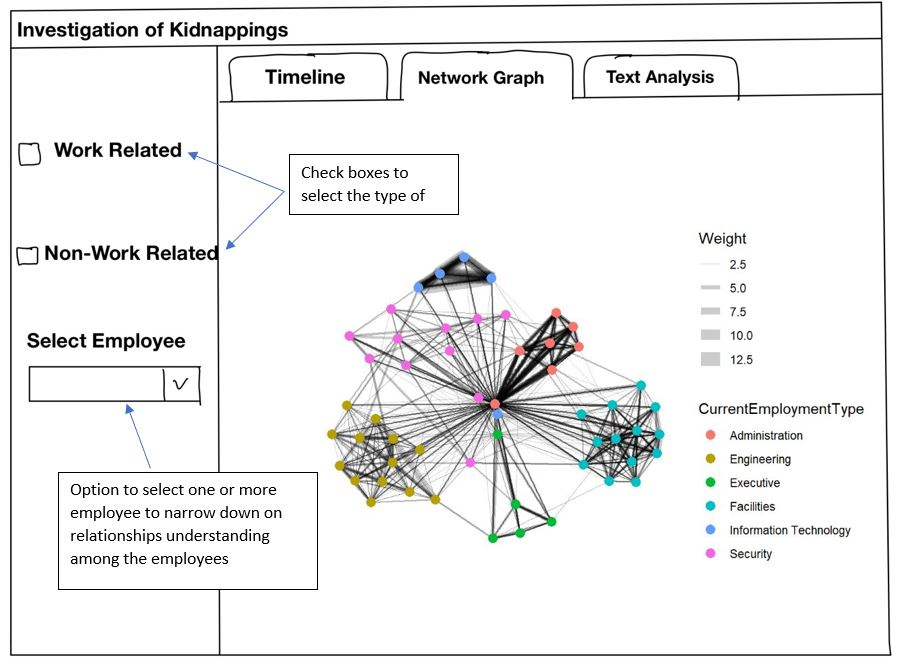
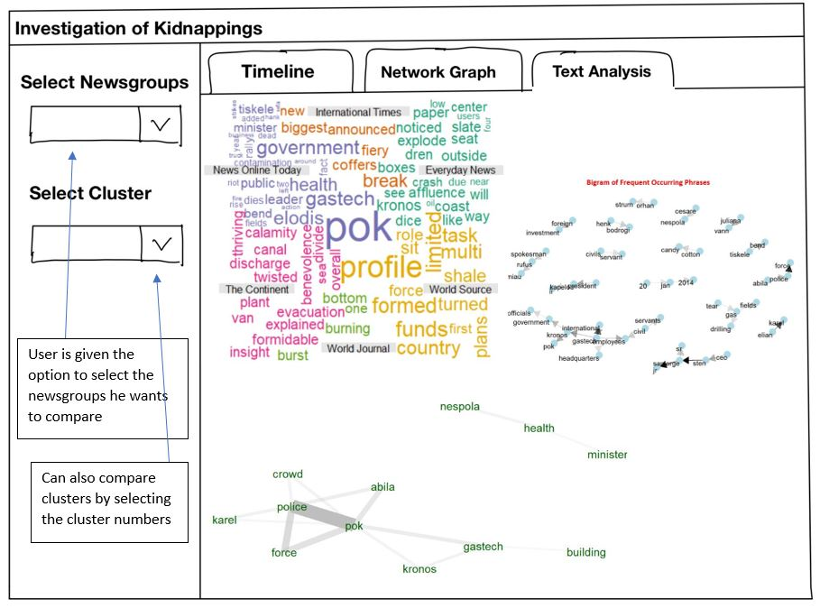

```{r setup, include=FALSE}
knitr::opts_chunk$set(echo = TRUE, warning=FALSE,message=FALSE)
```

**Why RShiny when we already have the visualizations?**

In our attempt to investigate, if we wanted to examine cluster 2 instead of cluster 1, we had to change the code by editing the filter criteria. This is not user friendly and to overcome this, we make use of a interactive user interface where the user can select any criteria he wants without having to edit the code. This UI is called RShiny.


## Prototype

There will be three tabs in the Shiny app on Kidnapping Investigations: Timeline, Network Graph and Text Analysis. Do note that the visualization ideas are not limited to the screen shots below and they are only for visualization purpose.

### Timeline

To enhance user experience, users would be given the feasibility to select the range of years or the dates of the year specific to 2014 to drill down on the sequence of events that took place in 2014. After user has selected the variables, the timeline will show the important events that unfolded in the selected years and also a bar plot  the frequent of keywords will be displayed.

<center>
{width=90%}
</center>

### Network Graph

For the network visualization, users can specify if they want to look into work related or non work related by selecting the appropriate check box. Apart from this, they can also narrow down on the number of nodes by selecting the nodes the user wants to see.

<center>
{width=90%}
</center>

### Text Analysis

Since a major component of this investigation is textual, there will be a collective of visualizations shown to the user to compare the text. The user can select one or more clusters from the drop down and also specific newsgroups he wants to compare.

<center>
{width=90%}
</center>